# 📜 Storyboard

The goal of this demo is to show the analysis of a C++ application in SonarCloud.
We want to showcase how to apply the "Clean As You Code" methodology in practice.

We start with a legacy application.
This legacy application contains `main` branch with the existing code.
It also contains an `add-feature` branch that represents a new feature we want to develop for the application.

The full set-up can either be done as part of the demo (takes about 15 minutes), or beforehand.
Branch `enable-ci-analysis` is available to move from Automatic Analysis to a CI-based analysis,
with the import of code coverage information.

Once the repository is fully set up, you can observe the concept of PR Quality Gate on new code
and its independence from the main code issues.
The application features basic, yet varied, issue types that can be detected by SonarCloud. In the PR, we have:

* A simple bug with no secondary locations  
  [S935](https://rules.sonarsource.com/cpp/RSPEC-935/): Function exit paths should have appropriate return values.
* A code-smell with two secondary locations  
  [S924](https://rules.sonarsource.com/cpp/RSPEC-924/): Loops should not have more than one `break` or `goto` statement.
* A bug with an execution flow  
  [S2107](https://rules.sonarsource.com/cpp/RSPEC-2107/): Member variables should be initialized.
* A bug with multiple flows across files  
  [S5782](https://rules.sonarsource.com/cpp/RSPEC-5782/): POSIX functions should not be called with arguments that trigger buffer overflows.
* A "bad practice" code smell  
  [S5025](https://rules.sonarsource.com/cpp/RSPEC-5025/): Memory should not be managed manually.
* A stylistic code smell  
  [S5827](https://rules.sonarsource.com/cpp/RSPEC-5025/): `auto` should be used to avoid repetition of types.

Additionally, we have a security hotspot on the `main` branch:

* Security-sensitive functions, like `strcpy` or `sprintf`  
  [S5801](https://rules.sonarsource.com/cpp/RSPEC-5801/): Using `strcpy` or `wcscpy` is security-sensitive.
* Appropriate file-access permissions  
  [S2612](https://rules.sonarsource.com/cpp/RSPEC-2612/): Setting loose POSIX file permissions is security-sensitive.

When setting up CI-based analysis,
you will also import code coverage (in the `enable-ci-analysis` branch).

To demo SonarLint you can also clone this project to show the issues in SonarLint.
Some of the issues have quick fixes for them.

You can show the connected mode by simply following the tutorial in the IDE,
which allows

- the synchronization of silenced issues,
- custom quality profiles, and
- additional cross-TU issues.

# 🛠 Building and running the application

### Build Dependencies
- Install [git](https://git-scm.com/book/en/v2/Getting-Started-Installing-Git)
- Install [CMake](https://cmake.org/install/), if building with CMake
- Install libjson-c-dev, required by the `server` target
- Install qtdeclarative5-dev, required by the `client` target
- Install libpoppler-qt5-dev, required by the `client` target

### Building with CMake
```shell
cmake -S . -B build

# Either build all available targets
cmake --build build --target all
# or build a specific target
cmake --build build --target server
```

### Building with Make
Building a specific target is also possible using make
```shell
make server
```

### Running the application
The executables will be put into the newly created `build` folder
- `build/server` has to be run before the client
- `build/client` is the GUI client interacting with the server

# 📝 Setup instructions

We are going to set up a SonarCloud analysis on this project.
We will visualize issues on the `main` branch and pull requests and see how PRs get decorated automatically.

We will then set up a CI-based analysis and import code coverage information into the SonarCloud UI.

Useful link: https://docs.sonarcloud.io/

## 🛫 Getting Started

* Fork this project *with all branches*
  (untick the default checkbox, "Copy the `main` branch only").
* Go to https://sonarcloud.io/sessions/new and sign up with your GitHub account.
* Create a new organization under your name if there is none.
* Give SonarCloud permission to see the forked repository.

# 🎥 Demo

## 🤖 Automatic Analysis on SonarCloud

* Click ➕ in the top-right corner and select "Analyze new project"
* Select the forked repository.
* Click "Set Up"

Note two things, useful for the following step:

* Among the many detected issues,
  there is no report for [S1068: Unused "private" fields should be removed](https://rules.sonarsource.com/cpp/RSPEC-1068/).

  
* Test coverage metric is not computed.

  

## 👷 CI-based analysis on SonarCloud with a coverage display

This step assumes you have added the project to SonarCloud and executed automatic analysis (see the previous step).

For examples of CI-based analysis on other platforms, see https://github.com/sonarsource-cfamily-examples

* Click ⚙ "Administration" on the bottom-left and select "Analysis Method"
* Disable the "Automatic Analysis" switch.
* Generate a SonarCloud token:
  * Click on your profile picture in the top-right corner and select "My Account".
  * Select the "Security" tab.
  * Enter a token name (e.g. `cpp-demo`), and click on "Generate Token"
  * Copy the token to clipboard
* Enter the token to the repository secrets on GitHub
  * Select the ⚙ "Settings" tab of your repository
  * Select the "Secrets and variables"/"Actions" section
  * Click on "New Repository Secret"
  * Enter the name of the secret: `SONAR_TOKEN`
  * Paste the secret from the previous step.
  * Click "Add Secret".
* Edit "sonar-project.properties" on the `enable-ci-analysis` branch.
  * You can check it out locally, or edit it directly on GitHub:
    (substitute `<your account>` in this link:
    `https://github.com/<your account>/cpp-demo/edit/enable-ci-analysis/sonar-project.properties`)
  * In "sonar-project.properties" change the `sonar.projectKey` and
    `sonar.organization` to use your organization name (your GitHub username).
* Commit, push, and merge the branch into `main` (careful: select your fork as the target)
* After a couple of minutes, you should be able to see the analysis results on SonarCloud

Note that the total number of issues has changed
because CI-based analysis analyses only the code you compile
in the configuration that you provide.
If a file is never compiled, it will not be analyzed, unlike with automatic analysis.

Note also that some issues appeared.
For example, the code smell: [S1068: Unused "private" fields should be removed](https://rules.sonarsource.com/cpp/RSPEC-1068/).
These issues cannot be confidently detected because they require knowledge of all places where the field might be used.
On one hand, if the automatic analysis could not figure out how to reach the place that uses the field,
it will miss it and falsely report a violation of this rule.
On the other hand, CI-based analysis is precise, it knows as much as your compiler.
If a field isn't used in any code that is compiled, it is not used in your application,
at least when it is built with the given configuration.


Note also that now you can see the test coverage of the code.
At the moment CI-based or manual analysis is the only way
to display test coverage on SonarCloud or SonarQube.
This is because to gather test coverage, you will need to run the
tests and that is difficult to do without knowing where the tests are and how
they are built.
It is also dangerous because it involves executing unknown code.


## 🔍 What you can find in your Sonar report

Sonar reports various kinds of findings.
Here is a selection that you can find in this demo project:

### 🪲 Bugs, 🧀 code smells, 🎯 vulnerabilities

In the "Issues" tab, you can filter and explore bugs, vulnerabilities, or code smells.

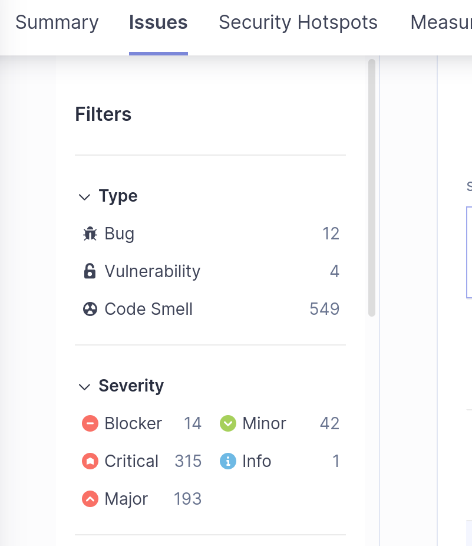

### ♨ Security hotspots

Security hotspots are a special kind of finding that just draws your attention to sensitive code.
All you need to do is take a second look and make sure you are not committing a common mistake.
Once you do that, you can change the status of the hotspot, and it will not bother you again.
Or you might discover a bug.


### 🌊 A bug with an execution flow

Deep bugs and vulnerabilities are difficult to understand without the execution context.
An execution flow demonstrates the steps the program could have taken that led to the bug.

Once your code is analyzed,
you can find an example of a bug with an execution flow on line 831 of serverMain.h.
Replace the two occurrences of `<your account>` with your GitHub account
in the following link and navigate to it:
`https://sonarcloud.io/code?id=<your account>_cpp-demo&selected=<your account>_cpp-demo%3Asrc%2FServer%2FserverMain.h&line=831`

You should see a bug icon 🐞 next to line 831, like this:


If you click on it, you can see the issue details, including the execution flow steps:

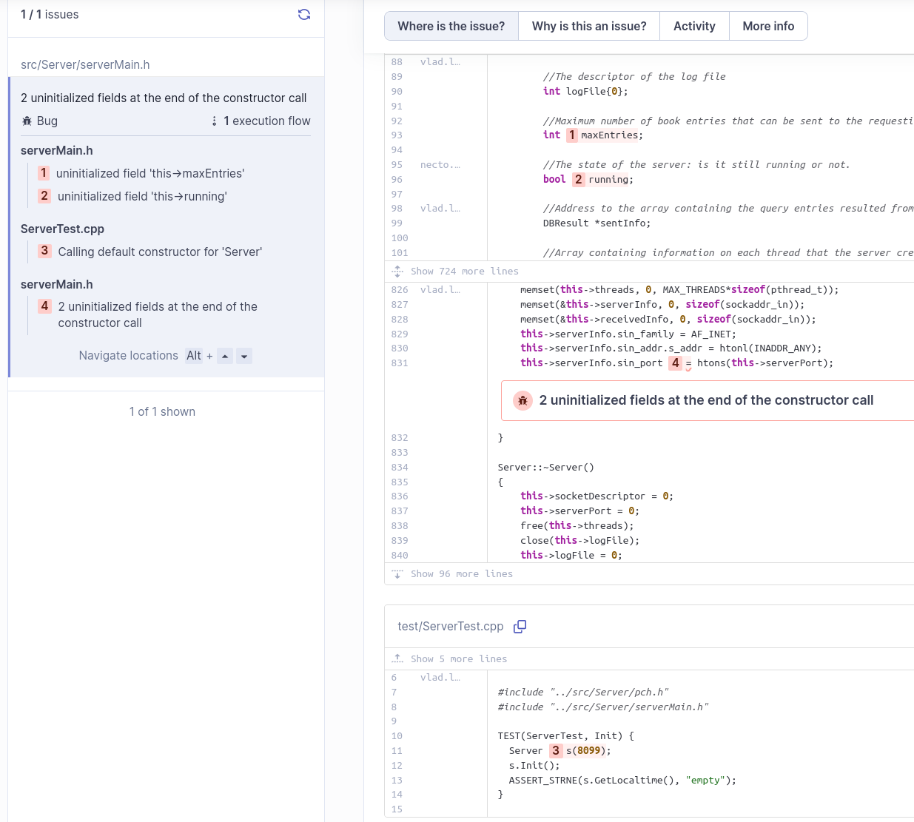

### 🎋 A vulnerability with an execution flow as well as highlighted data flows.

Some particularly deep bugs and vulnerabilities require more context to understand.
Sonar provides this context by offering the data flows for values relevant to an issue.
To see an example you will need to set up [CI-based analysis](#-ci-based-analysis-on-sonarcloud-with-a-coverage-display)
(this issue is not detected in automatic analysis).

Once your code is analyzed with CI-based analysis,
navigate to the "Issues" tab, and select "Vulnerability" and "Blocker" filters.
You should see a vulnerability detected by [S5782](https://rules.sonarsource.com/cpp/RSPEC-5782/).
Alternatively, you can search for "S5782" in the "Rule" filter in the "Issues" tab.

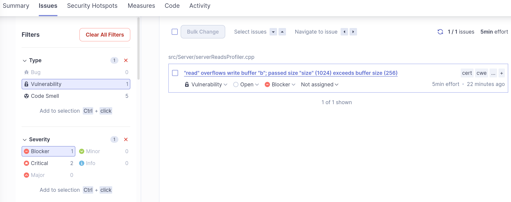

After clicking on the issue for a detailed view,
you will notice multiple accordeons on the left side:
* A data flow for the size argument that overflows the buffer
* A data flow for the buffer argument
* The execution flow

As you can see, the execution flow, in this case, is not very informative,
but the data flows allow you to track where the incorrect values of
a memory buffer and a read length come from.


## 🧹 PR analysis: Clean as You Code

This step requires one of the analysis methods (automatic or CI-based) set up.

Let us open a pull request:
* Substitute `<your account>` in two places in this URL and navigate to it:
  `https://github.com/<your account>/cpp-demo/compare/main...<your account>:cpp-demo:add-feature`
* Click on "Create pull request" twice.
* Wait until the analysis finishes
  (the yellow circle 🟡 next to the commit hash should appear
  and turn into a red cross ❌ because the quality gate fails).

After a couple of minutes, you will see a quality-gate message in your pull request.

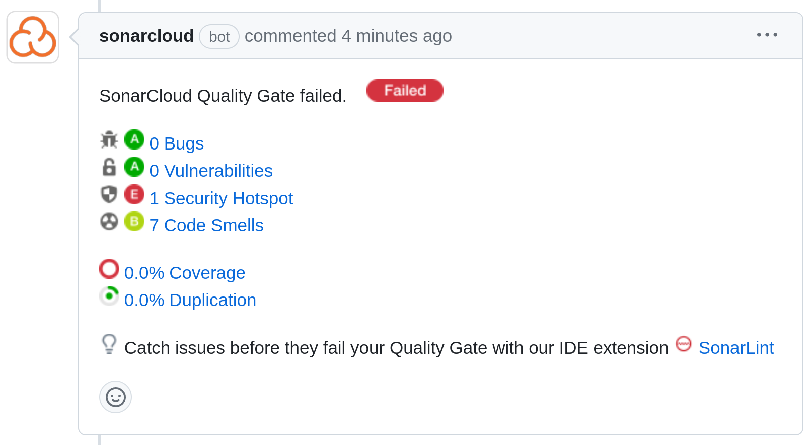

Clicking on a link in the message will bring you to the detailed quality-gate view.
Here you can see much fewer findings.
These are findings relevant only to your pull request:
- the new issues or vulnerabilities that you created.
- the pre-existing issues or vulnerabilities in the code that you have modified.

These few issues and vulnerabilities do not take too long to review and fix.
That is the cracks of the Clean as You Code approach:
Clean only the code that you write or modify.
Do not try to fix all the problems in the project.

## ⚡ SonarLint: Fix issues before they exist

Alongside the CI-based analysis, SonarLint allows the detection of most issues directly in the IDE.
In this way, you can fix most issues before they even reach the CI check.

Supported IDEs:
- Visual Studio
- Visual Studio Code - shown in the demo
- CLion - shown in the demo
- Eclipse

### ⌨ Visual Studio Code

Sonarlint can be acquired from the Extension Marketplace.

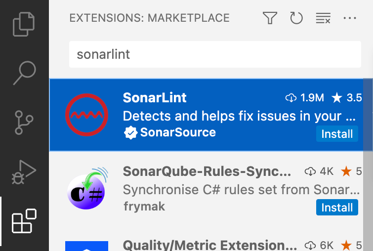

SonarLint for VSCode uses a generated `compile_commands.json` to detect the options used to compile the sources.
Initially, SonarLint is not aware of the location of the relevant `compile_commands.json` file.
Once installed, upon opening a C or C++ file, the following notification will appear.


Clicking 'Configure compile commands' will enable SonarLint to look for a `compile_commands.json` in your project's directory structure, resulting in one of the following:

- If no such file is found, you will be linked to a guide on how to generate this file.

  
- If one such file is found, SonarLint will automatically select it.
- If multiple such files are found, you will be able to select the one SonarLint will use.

You can also set the path to `compile_commands.json` manually, by use of the following property:

```json
{
    "sonarlint.pathToCompileCommands": "path/to/compile_commands.json"
}
```


Once this is set up, SonarLint will start raising issues. These will appear in the Problems View.


SonarLint will also highlight the code that triggers the issues in the editor. You can see the issue by hovering over the highlight.

serverMain.h:422


SonarLint will re-analyze your code automatically whenever it detects a code change.


### 🦭 CLion

SonarLint can be acquired from Settings > Plugins > Marketplace,
For a complete installation, you will have to restart the IDE after installation.

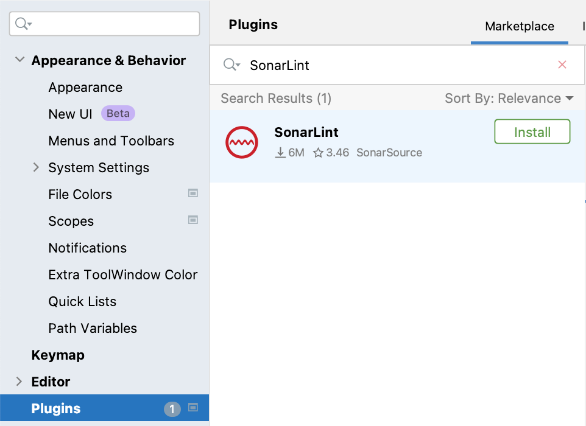

Once installed, SonarLint will analyze the sources part of the available build targets.
Any found issues will appear in the Problems view, but also as part of the dedicated SonarLint view, in the Current File tab.


SonarLint will also highlight the code that triggers the issues in the editor. You can see the issue by hovering over the highlight.

serverMain.h:422


SonarLint will re-analyze your code automatically whenever it detects a code change.
The automatic analysis can be deactivated in SonarLint's settings menu.

The analysis can also be triggered manually from the SonarLint view:

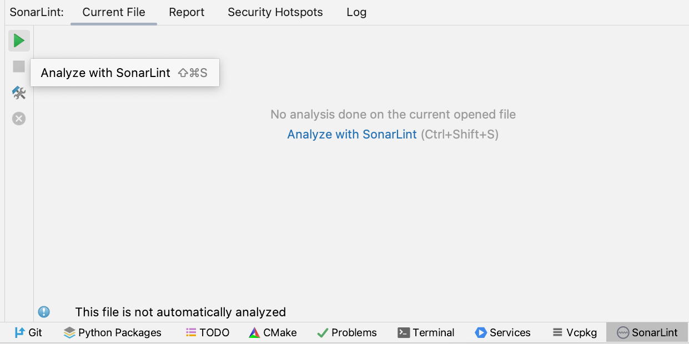

SonarLint will also analyze your staged changes before a commit to a VCS. This is enabled by default, and can be disabled in the Commit view:

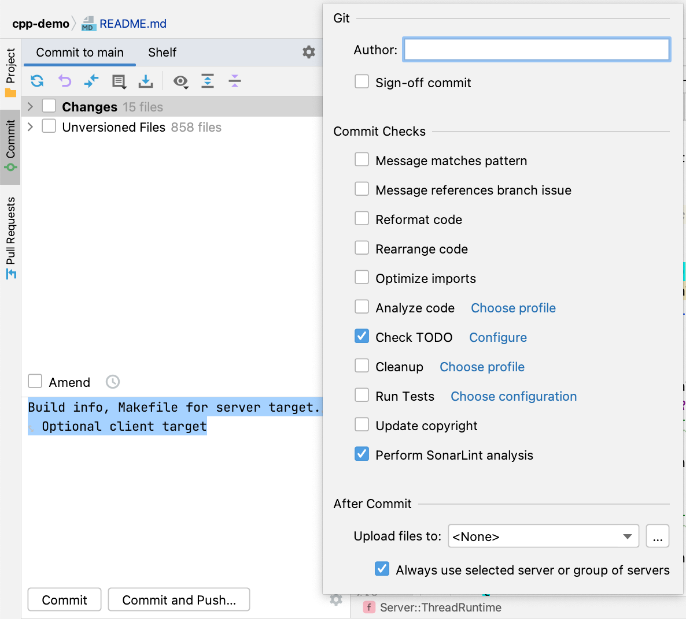

### 📄 Show rule description

Issues are raised based on the rule these issues break.
To properly fix an issue, understanding the rule is vital.

The full database of rule descriptions is available at [rules.sonarsource.com](https://rules.sonarsource.com/cpp/).

SonarLint provides the rule descriptions of its built-in rules and can be accessed in the IDE.

Note: SonarLint supports a majority of the rules in the online database, but not all.

#### From the issue

In both mentioned IDEs, the Rule Description can be directly accessed from the 'Quick Fix' menu in VSCode, and from the 'More Actions' menu in CLion.
These appear when hovering code raising an issue in the editor, or by selecting the issue in the Problems view,

serverMain.h:422


In VSCode, the rule description will open in a separate editor tab.

serverMain.h:422


In CLion, the rule description will open in the SonarLint view.

#### Issue to Rule - CLion
In CLion, inside the SonarLint view, you can access the rule description immediately by selecting any rule in the SonarLint view.


#### Rule navigation - VSCode
In VSCode, you can view all available rules (Active or Inactive) in the SonarLint tab. Select a rule and its description will open.

Only active rules will raise issues. Active rules can be changed in this panel by:
- Activating inactive rules by pressing the check mark next to the rule.
- Deactivating active rules by pressing the cross mark next to the rule.


#### Rule navigation - CLion
In CLion, you can view all available rules (Active or Inactive) in SonarLint's settings (Settings -> Tools -> SonarLint). Select any rule and its description will appear.

Only active rules will raise issues. The checkbox next to the rules in the list will activate or deactivate them.

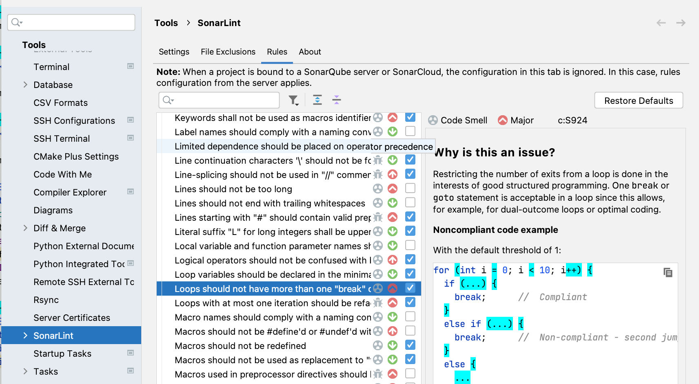

### 🪛 Quick Fix

Particular rules also support quick fixes in the IDE. Using these, you can instantly refactor the problematic code into compliant code.

In VSCode, a quick fix will appear as the first item in the 'Quick Fix' menu.

serverMain.h:490


In CLion, a quick fix will appear when hovering over an issue that has a quick fix available.

serverMain.h:490


Applying the quick fix in both cases, we get the following:


### 🔌 Connected mode: synchronize issues between SonarCloud and SonarLint

You can connect SonarLint to a SonarQube/SonarCloud instance for the current project. This is called Connected Mode, and it provides multiple advantages:

- Synchronising active rules with the ones used in the CI analysis.
- Viewing the issues raised by the CI analysis that are not available in SonarLint.
- Viewing and reviewing Security Hotspots.

For this demo, we will be configuring Connected Mode with a SonarCloud instance.

#### ⌨ Visual Studio Code

Connected Mode in VSCode can be accessed from the SonarLint tab.


From this, we will use 'Add SonarCloud Connection':

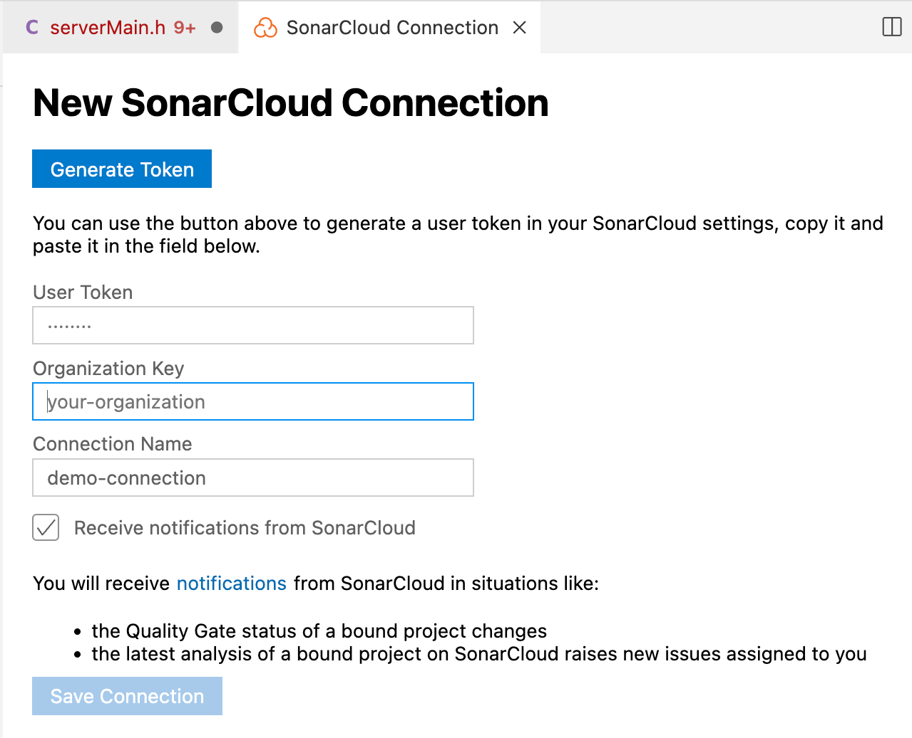

The required data can be acquired as follows:

- You can generate a user token by using the 'Generate Token' button. This will redirect you to your SonarCloud account security, where you will be able to create a new token.


- The organization key is found in the organization where the project in SonarCloud is analyzed.

Once complete, you will have to select the project to bind to:


Once bound, the project will appear in the Connected Mode section, and synchronization will commence.

For example, the Security Hotspots section will now be populated, and the issues will directly redirect to code in the editor.

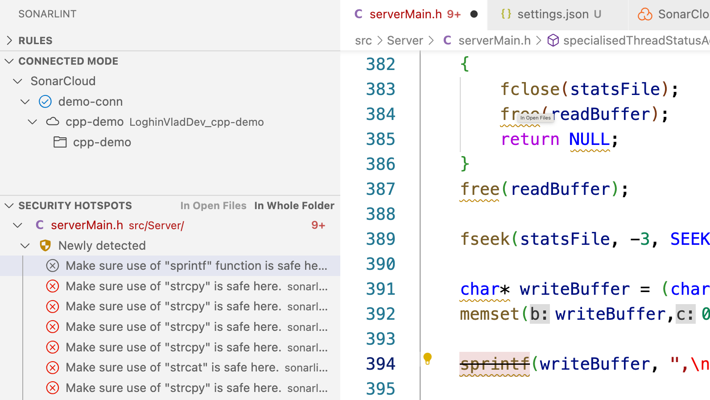

#### 🦭 CLion

Connected Mode in CLion can be accessed from the SonarLint view's configuration.


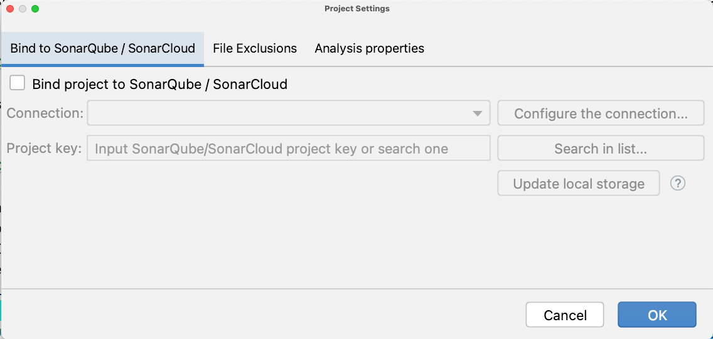

From this, we will use 'Configure the connection...' -> Add:


Name the connection and select the type:


And use 'Create Token' to be redirected to SonarCloud Security to generate a user token:


After completing the connection, use 'Search in list...' to select the project you want to bind to.

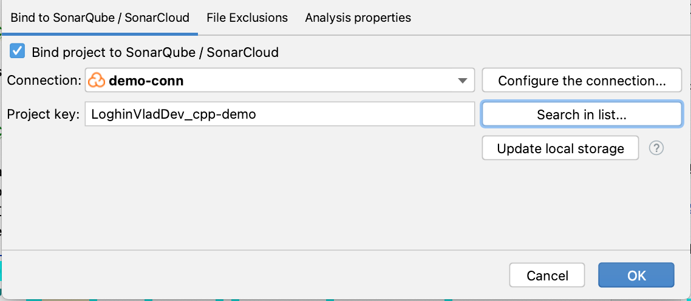

In the end, press 'Ok', and the synchronization will commence. Synced features will activate afterward.

For example, the Security Hotspots section will now be populated, and the issues will directly redirect to code in the editor.

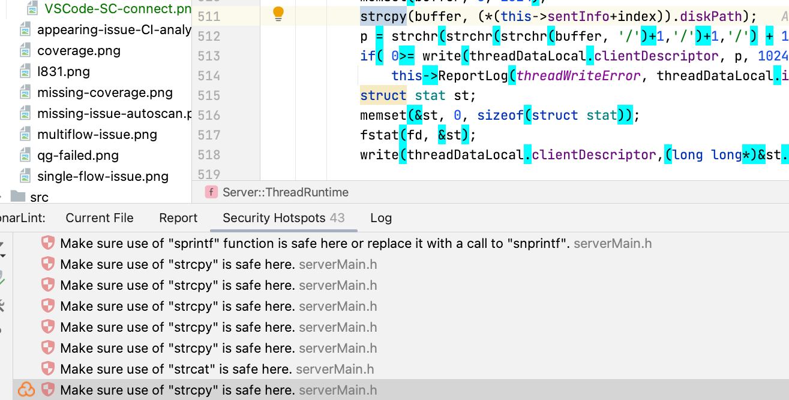

You can review Security Hotspots that have a SonarCloud icon directly in the IDE, using 'Change Status'.


# 🛬 Teardown

To prepare for the next demo, you should delete the project from SonarCloud:

* Open the demo-cpp project.
* Click on ⚙ "Administration" in the bottom-left corner, and select "Deletion".
* click on "Delete" and confirm it by entering your project name.

You might also want to delete it from your GitHub account
Click the button at the bottom of the ⚙ "Settings": `https://github.com/<your-account>/cpp-demo/settings`
